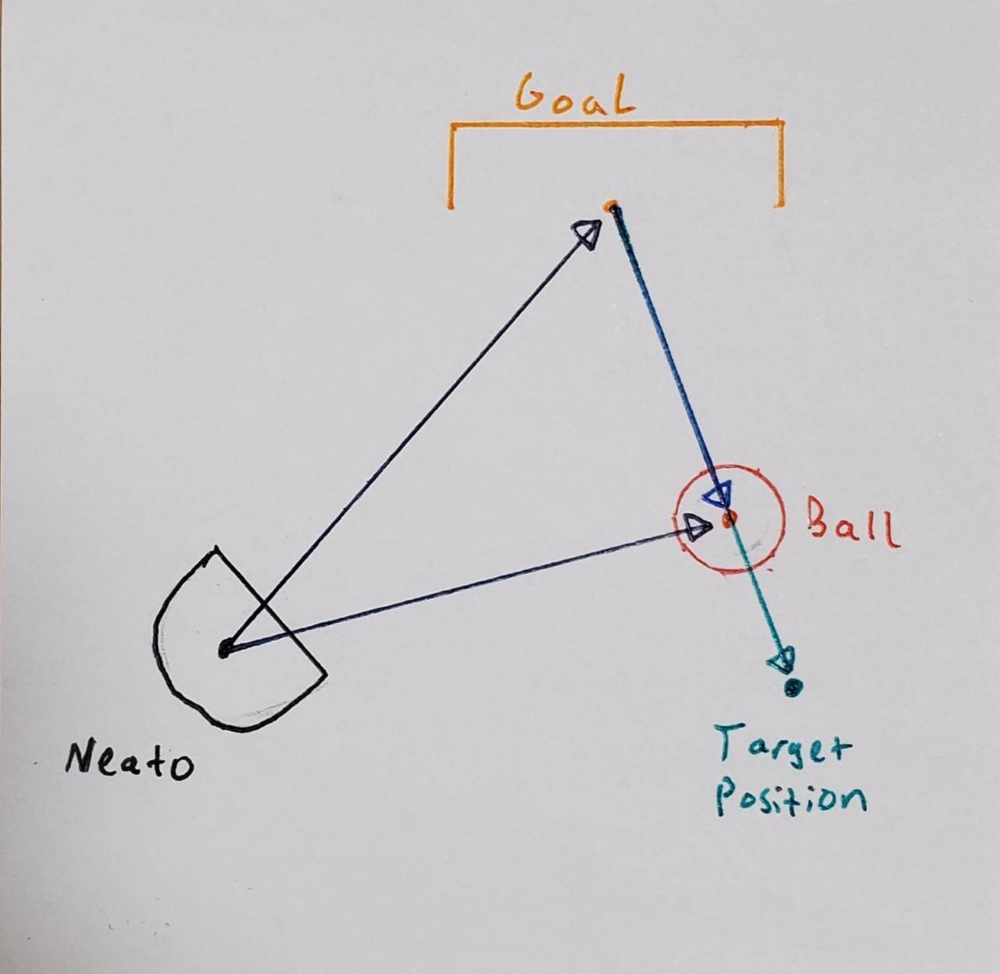
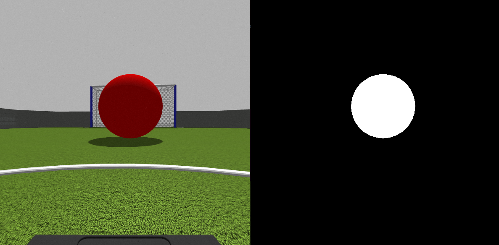

# Vision-Tracking
Comprobo Vision Tracking Project

[insert image of neato soccer at work]

Here we see a robot using vision processing to kick and score goals. Read on to understand what is happening.

##Intro:
This is a project for Olin College of engineering's 2020 fall semester course Computational Robotics. The authors of this writeup and implementation are:

Timothy Novak

Loren Lyttle

The goal of this project was generally to develop a robotic system which reacts to visual input taken through a camera. The more specific goal of this project was to attempt to use visual processing to create a robot which could kick a ball towards a goal.

##Table of Contents
Overview
Our Approach
Design decisions
Challenges
Project extensions

## Overview:

Computer vision, or the process of a computer using a camera to perceive its environment, is an important skill to understand when designing robotic systems. This is because cameras are generally a cheap information dense source of information. This makes them an ideal candidate for a sensor on a robotic platform. However, computers unlike our minds can't readily process images and extract useful information and so many techniques have been developed to allow computers to process images. These range from complex machine learning algorithms such as you would see on a self driving car, or more simple image adjustments such as color balance correction which is available on some drones.

Due to the importance of computer vision for robotics projects we designed our project to provide a good environment for learning fundamental computer vision concepts and integrating them into a robotic control scheme. The project we settled on was robotic soccer where the robot would have to use a camera to find a ball and a goal and maneuver itself in order to kick the ball into the goal. This would help us learn some of the fundamental computer vision tools such as object detection, object localization in an image, image filtering, and camera distortion then we could take those concepts and actually implement them in a useable way to inform a control algorithm for the robot's movement.

## Our Approach

### The controller

The controller has a few fundamental behaviors it switches between to create the behavior of the robot.

#### Searching

The default behavior of the controller is that it tries to locate the ball and the goal in the global coordinate frame. The main action the robot will make during this process is to turn while looking for the ball. This way the robot can locate the ball even if it is not in the camera's line of sight.

The robot also starts with knowledge of where it is located in the map and so it keeps an internal notion of the location of the goals so it can locate them even if they are outside of the camera frame.

#### Positioning

Once the ball is located, the neato needs to calculate where to go in order to bump the ball towards the goal. We decided to do these calculations in the map frame. Given the ball and odom_data, we created a transformer function to convert a poler coordinate in the base_link frame to a Cartesian in the map frame. We also knew the position of each goal in the map, and decided that the center of each goal's opening would be the ideal spot to aim for. Looking at the image below, we used the vectors to the ball and goal from the robot to create a vector from the goal to the ball. This vector represented the direction the ball needed to travel to make a goal (albeit in the opposite direction). Extending this vector along it's trajectory allowed us to find the best position for the neato to kick from.

The neato then travels to the calculated position and prepares itself to kick the ball.

#### Kicking

Once the neato has arrived at the desired kicking position it turns to center the ball in its camera view and moves into kicking range. To actually kick the ball the neato rams it at 3 m/s thus launching the ball in the desired trajectory.

### Vision tracking

Computer vision was used in this project to track the positioning of the ball. To simplify this process we used the open cv. python library. This python library contains some basic image processing tools to help so we did not have to reimplement all of our processes based on pixel correlations. 

The bulk of our vision processing was used for tracking the ball, however we also implemented code which used the same process to Find the goals however we did not develop a solid method of determining the distance to the goal due to sensor limitations and so the computer vision identifying the goals was not used by the neato.
 
### Image Filtering

The first task was to identify the ball in the camera view. To help in this endeavor we colored the ball red, a color which was distinct from the environment. This allowed us to filter the image by color. If colors in the image were within a certain range of values in the Blue, Green, Red color spectrum they were labeled as being part of the ball or not part of the ball. This in tern created a 'binary image' all pixels which contained the ball were represented in white while all of the background pixels were represented in black.

### 'Center of Mass' calculation to find image coordinates of the ball

We then determined the location of the ball in the image by finding the 'center of mass' in image space of the white pixels in the image. Performing this calculation across each axis of the image allowed us to retrieve x,y coordinates in the image for the ball.

### Pinhole camera method to convert the pixel location into a heading relative to the robot

We converted the pixel positioning of the object into a world position by combining the pinhole camera method to find angle relative to the robot and the LIDAR to find the distance.

The basics of the pinhole camera method geometrically relate an object's location in the real world with its location in the image by representing the light as being focused through a small hole at the focal length of the camera.

The formula for finding the angle of an object relative to the camera is the following:

`angle = atan(xPosition / focalLength)`

For this project we did not know the focal length of the camera and so we had to calculate it from it's relation with the camera's field of view which we measured experimentally. The calculation is expressed in the following expression:

`focalLength = -300 / tan(vanishingAngle)`

The vanishing angle is the experimentally measured property which describes the maximum angle the field of view of the camera makes with the line normal to the camera's face.

These calculations provide the angle in real world space relative to the robot's axies we then queried this angle in the LIDAR scan to determine how far away the ball was from the robot.

## Challenges

### Losing sight

One of the largest drawbacks of using camera vision rather than LIDAR is its limited viewing angle. When looking for the ball and turning the robot, the ball often skipped in and out of frame before it was recognized by the color filter. An effective solution to this problem was utilizing variable speed control for turning the robot. More specifically, the angular speed of the robot was proportional to how centered the ball was in the image. Slowing the rotation as the ball reached the center both eliminated the skipping issue and resulted in faster centering.

Another problem caused by the narrow window of the camera was keeping track of the ball when positioning the robot to kick it. Lining the neato up with the ball and the goal often required turning the neato away from the ball to head towards the more strategic position. However, many parts of our code relied upon knowing the ball's position and distance from the robot. Initially, this problem lead to the neato circling the ball, like it was too scared to leave it. Our state oriented Arbiter reduced this problem by ignoring these reliant functions until the neato made it to the lineup position.

### Incorporation with LIDAR

Over the course of this project, we learned that both camera vision and LIDAR have their benefits and drawbacks. While the camera has a relatively narrow range of sight, the LIDAR has limited distance. One of the challenges in this project was combining the two to cover up for the other's weaknesses. For most of the project, the ball was considered 'defined' as long as it was in view of the camera. Being 'defined' triggered other functions, such as calculations for the best angle to kick it. Later we realized that, while a ball at the far end of the soccer field was easily visible to the camera, the LIDAR registered 'inf' untill the distance was under ten meters. Our solution to this was to further specify the conditions under which a function would be called. Defining these parameters was a meticulous and time consuming process.

## Future Improvements

### Updating the estimation of the robot position.

The current robot tracks where the goals are relative to it by estimating their position based on its wheel encoder measurements and how it moves through the map. Wheel encoders are subject to 'drifting' if they are not recalibrated with the outside environment. One feature we were intending on adding but we ran out of time is the ability for the robot to correct for drift by updating its position estimate whenever it saw a goal. We ended up implementing vision processing to find th heading to the goal, however when trying to find a distance to the goal we had difficulties due to the LIDAR's limited range. In order to fully implement the robot correcting its estimates we would have to estimate the distance to the goal from the images included in the camera and unortunately we did not have the time to fully implement this feature.

### Ball Path Estimation

One of the drawbacks of our current model is that it doesn't work well for kicking moving objects. The robot sees the ball once, calculates how to kick it to the goal, then moves to that point before checking the position of the ball again. If the ball were moving fast, the neato would be constantly behind. An interesting direction for further exploration may go into predicting where the ball will be by the time the neato can make it there. Real soccer players must do this constantly, and barely even think about predicting the uninterupted path of the ball. However this method may be too much for the current gazebo setup we are using. It was not clear in our study whether the refresh rate of the ball's position was fast or accurate enough to compute ball velocities and directions while the neato itself is moving. Perhaps better combining the LIDAR and camera, or integrating a new sensor would make this more feasible.

### Defence Neato's

In soccer offense is not everything. To play a real game with neatos (at least the simplest 1 versus 1) the robot should know how to play defence. One way to do this would be to estimate the path of the ball, as previously mentioned. However a more sophisticated approach may use probability fields to determine the most likely position at which a rolling ball will be intercepted.  
